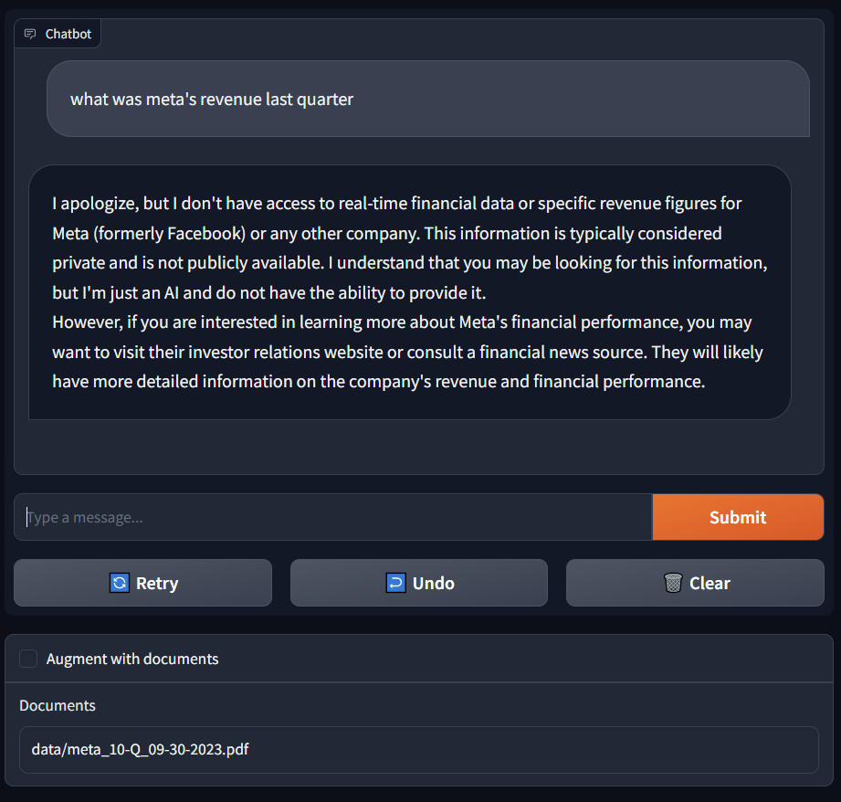

# raggy: a minimalist retrieval-augmented generation (RAG) app

Retrieval-augmented generation (RAG) is a paradigm for augmenting large language models with custom data. In this repository, we build a starter RAG application for demonstrating a common use case of  document question answering.

## System Architecture

We ingest PDF documents (e.g., Meta Form 10-Q for 09/30/2023) through an embedding model and store the embeddings in a vector store/database. When the user asks questions related to the documents, we retrieve the relevant context from the vector store, and augment the large language model with it. We leverage the following technologies to build various components of our system.

Component | Technology
---|---
Large language model | [Llama 2 7B](https://github.com/facebookresearch/llama), quantized and run locally with [llama.cpp](https://github.com/ggerganov/llama.cpp)
Embedding model | [bge-small-en-v1.5](https://huggingface.co/BAAI/bge-small-en-v1.5)
Vector store | [faiss](https://github.com/facebookresearch/faiss)
Data framework & Glue | [llama-index](https://github.com/run-llama/llama_index)
User interface | [gradio](https://github.com/gradio-app/gradio)

## Build
Note: to run the LLM (LLama 2 7B) fast enough locally, a decent NVIDIA GPU is needed (ideally >4GB GPU memory).

Clone the repo
```
git clone https://github.com/yifanai/raggy.git
```
Build with Docker
```
cd raggy
docker build -t raggy .
```

## Run
We choose a relatively small & quantized version of Llama 2 7B to run locally with llama.cpp. First download the weights from [https://huggingface.co/TheBloke/Llama-2-7B-Chat-GGUF](https://huggingface.co/TheBloke/Llama-2-7B-Chat-GGUF) with the command:
```
wget https://huggingface.co/TheBloke/Llama-2-7B-Chat-GGUF/resolve/main/llama-2-7b-chat.Q4_K_M.gguf -P app/models/
```
Once the download finishes, start the Docker container, exposing port 7860 for gradio web UI server.
```
docker run --gpus all -it --rm -p 7860:7860 -v $(pwd)/app:/app raggy
```
The Docker container:
1. downloads tokenizer and embedding model
2. ingests documents and store embeddings
3. loads the large language model
4. starts the web UI server

Once the web UI server starts, the UI may be opened using a browser at: **[http://localhost:7860](http://localhost:7860)**

## Vanilla LLM response
When we ask a question about Meta's revenue last quarter, without the proper context and up to date information, the vanilla LLM is not able to provide an answer.



## Retrieval-augmented response
We tick the checkbox to augment the LLM with additional context from the document, Meta 10-Q for the quarter ending on 09/30/2023. Now the LLM is able to answer various related questions.

